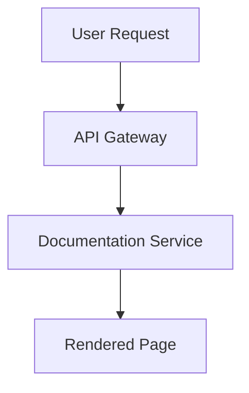

## Recent Updates

<Update label="2024-10-15" description="v1.2.0" tags={["feature", "bugfix"]}>

## New Features

- Added full support for Mermaid diagrams as native code blocks. You can now create flowcharts and sequence diagrams directly in your MDX files without JSX components.

````markdown

````

- Introduced `<Columns>` component with up to 5 columns for better layout flexibility in feature grids and comparisons.

## Improvements

- Enhanced code block highlighting with new themes and better nested code support using 4-backtick fences.
- Optimized rendering performance for pages with multiple `<Tabs>` and `<Steps>` components.

## Bug Fixes

- Fixed parsing errors caused by unescaped `{` and `}` characters in prose text.
- Resolved attribute quoting issues in JSX components, ensuring double quotes are enforced.

</Update>

<Update label="2024-09-20" description="v1.1.0" tags={["feature", "improvement"]}>

## New Features

- Launched `<Update>` component specifically for changelog entries, complete with tags like `feature`, `bugfix`, and `breaking`.
- Added `<ParamField>` and `<ResponseField>` for comprehensive API documentation sidebars.

<Callout kind="tip">
Use these for your API reference pages to generate automatic right-sidebars.
</Callout>

## Improvements

- Improved accessibility in all components with required `title` and `alt` attributes.
- Updated Lucide icon library integration for consistent visuals across docs.

</Update>

<Update label="2024-08-10" description="v1.0.0" tags={["feature", "breaking"]}>

## New Features

- Core MDX documentation engine with support for 15+ custom components including `<Steps>`, `<Tabs>`, `<CodeGroup>`, and `<Card>`.
- YAML frontmatter validation to prevent common parsing errors like blank lines.

## Breaking Changes

- Removed legacy `<Mermaid>` JSX component. Migrate to standard `mermaid` code blocks for diagrams.

## Initial Setup

- Brand integration with custom colors like `#3B82F6`.
- Self-hosted video and iframe embeds for tutorials.

</Update>

## Version Summary

| Version | Release Date | Key Tags          | Major Changes                     |
|---------|--------------|-------------------|-----------------------------------|
| v1.2.0  | 2024-10-15  | feature, bugfix   | Mermaid support, Columns component |
| v1.1.0  | 2024-09-20  | feature, improvement | Update component, API fields     |
| v1.0.0  | 2024-08-10  | feature, breaking | Core engine, component library    |

## Upcoming Changes

Stay informed about future releases. You will see enhancements to real-time collaboration and AI-assisted MDX generation.

<Columns cols={2}>
  <Card title="Submit Feedback" icon="message-circle" href="https://github.com/discussions" target="_blank">
    Share your ideas for new features or components.
  </Card>
  <Card title="GitHub Repository" icon="github" href="https://github.com/vyacheslav-ponomarev/docs" target="_blank" cta="View Commits">
    Browse full commit history and contribute.
  </Card>
</Columns>

<Callout kind="info">
Check back regularly or subscribe to updates via the [GitHub releases page](https://github.com/vyacheslav-ponomarev/docs/releases). For migration guides, visit the [/introduction](/introduction) page.
</Callout>