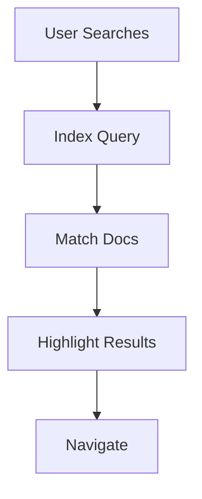

## Overview

Вячеслав Пономарев provides a comprehensive suite of tools to streamline your documentation workflows. You create, collaborate, organize, and share project docs efficiently. Key capabilities include intuitive editing, version control, powerful search, and flexible exports.

<Columns cols={3}>
  <Card title="Document Creation" icon="edit-3" href="#document-creation">
    Build rich MDX pages with live previews.
  </Card>
  <Card title="Version Control" icon="git-branch" href="#version-control">
    Track changes with Git integration.
  </Card>
  <Card title="Search & Organization" icon="search" href="#search-organization">
    Find content instantly across your docs.
  </Card>
</Columns>

## Document Creation and Editing Workflows

You start new documents directly in the editor, which supports MDX syntax for interactive components. The live preview updates as you type, ensuring WYSIWYG editing.

<Steps>
  <Step title="Create New Doc" icon="plus">
    Navigate to your workspace and select `New Document`. Choose a template or start blank.
  </Step>
  <Step title="Edit with MDX" icon="edit">
    Use markdown with JSX components like `<Callout>` for richer content.

````mdx
<Callout kind="info">
  This is an inline callout in your MDX.
</Callout>
````

  </Step>
  <Step title="Preview and Publish" icon="eye">
    Toggle live preview, then hit `Publish` to make it live.
  </Step>
</Steps>

<Callout kind="tip">
  Enable auto-save to prevent data loss during long editing sessions.
</Callout>

## Version Control and Collaboration

Вячеслав Пономарев integrates with Git for seamless version control. You branch, merge, and collaborate like in your code repos.

<Tabs>
  <Tab title="Git Workflow" icon="git-branch">
    Connect your repo via settings.

````bash
git clone https://github.com/your-org/docs.git
cd docs
git checkout -b feature/new-guide
````

    Commit changes and push to trigger previews.
  </Tab>
  <Tab title="Inline Collaboration" icon="users">
    Invite team members with role-based access.

    - Editors: Full write access
    - Viewers: Read-only
    - Admins: Manage permissions
  </Tab>
</Tabs>

## Search and Organization Tools

Powerful full-text search indexes all your docs. Organize with tags, categories, and nested navigation.

| Feature | Description | Benefit |
|---------|-------------|---------|
| Global Search | Query across all docs | Find content in `<1s` |
| Tags | Add `{["api", "guide"]}` metadata | Filter by topic |
| Navigation Tree | Auto-generated sidebar | Easy browsing |

<Expandable title="Advanced Tagging" default-open="false">
  Use structured tags for better discoverability:

````javascript
const tags = {["feature", "bugfix", "api"]};
````

  Apply via frontmatter in your MDX files.
</Expandable>



## Export and Sharing Options

Share your docs via public links, embeds, or exports. Generate PDFs, HTML zips, or even custom bundles.

<CodeGroup tabs="PDF,HTML,Embed">
````bash
# Export to PDF
npx @vyacheslav/export pdf ./docs --output docs.pdf
````

````bash
# Export static HTML
npx @vyacheslav/export html ./docs --output dist/
````

```html
<!-- Embed in your site -->
<iframe src="https://docs.vyacheslav.example.com/embed/guide" />
```
</CodeGroup>

<Callout kind="success">
  Exports preserve all interactive components like tabs and steps.
</Callout>